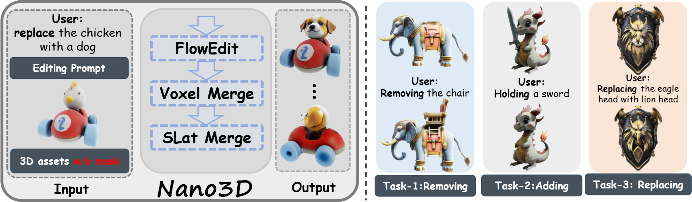
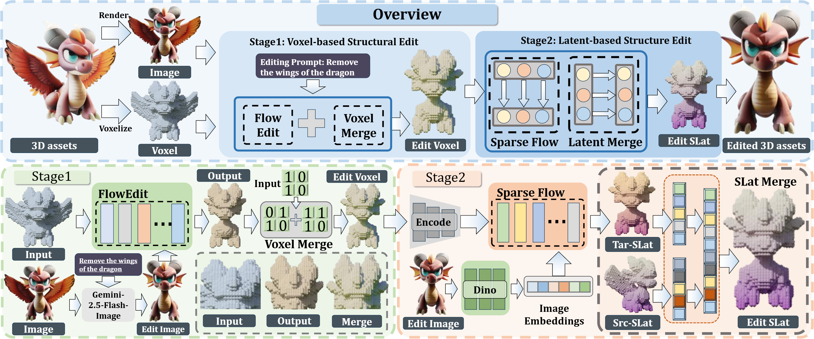
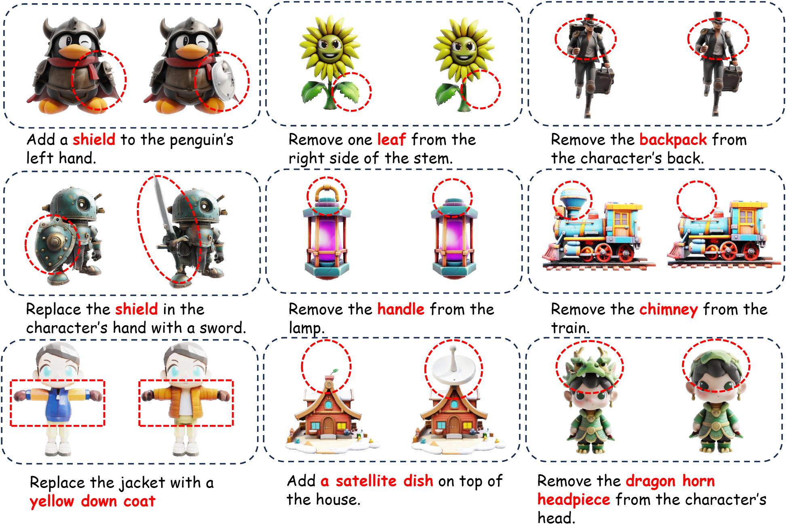

# Nano3D: A Training-Free Approach for Efficient 3D Editing Without Masks

[**Paper**](https://arxiv.org/abs/2510.15019) | [**Project Page**](https://jamesyjl.github.io/Nano3D/) | [**Datasets**] | [**Gradio**]

Official implementation of Nano3D: A Training-Free Approach for Efficient 3D Editing Without Masks

https://github.com/user-attachments/assets/1a382c9f-956b-4501-864d-f2838211b360


[Junliang Ye*](https://jamesyjl.github.io/), [Shenghao Xie*](https://shxie2020.github.io/), [Ruowen Zhao](https://zhaorw02.github.io/), [Zhengyi Wang](https://thuwzy.github.io/), [Hongyu Yan](https://scholar.google.com/citations?user=TeKnXhkAAAAJ&hl=en&oi=ao), Wenqiang Zu, Lei Ma, [Jun Zhu](https://ml.cs.tsinghua.edu.cn/~jun/index.shtml).

<p align="center"> All Code will be released soon... 🏗️ 🚧 🔨</p>

Abstract: *3D object editing is essential for interactive content creation in gaming, animation, and robotics, yet current approaches remain inefficient, inconsistent, and often fail to preserve unedited regions. Most methods rely on editing multi-view renderings followed by reconstruction, which introduces artifacts and limits practicality. To address these challenges, we propose **Nano3D**, a training-free framework for precise and coherent 3D object editing without masks. Nano3D integrates FlowEdit into TRELLIS to perform localized edits guided by front-view renderings, and further introduces region-aware merging strategies, Voxel/Slat-Merge, which adaptively preserve structural fidelity by ensuring consistency between edited and unedited areas. Experiments demonstrate that Nano3D achieves superior 3D consistency and visual quality compared with existing methods. Based on this framework, we construct the first large-scale 3D editing datasets **Nano3D-Edit-100k**, which contains over 100,000 high-quality 3D editing pairs. This work addresses long-standing challenges in both algorithm design and data availability, significantly improving the generality and reliability of 3D editing, and laying the groundwork for the development of feed-forward 3D editing models.*

<p align="center">
    
</p>

## Method

Overall Framework of Nano3D. The original 3D object is voxelized and encoded into sparse structure and structured latent respectively. Stage 1 modifies geometry via Flow Transformer with FlowEdit, guided by Nano Banana–edited images. Stage 2 generates structured latents with Sparse Flow Transformer, supporting TRELLIS-inherent appearance editing. Voxel/Slat-Merge further ensures consistency across both stages before decoding the final 3D object.
<p align="center">
    
</p>

## Result

We present three edit types—object removal, addition, and replacement. In each case, Nano3D confines changes to the target region (red dashed circles) and produces view-consistent edits, while leaving the rest of the scene unchanged. Geometry stays sharp and textures remain faithful in unedited areas, with no noticeable artifacts.
<p align="center">
    
</p>

## BibTeX

```bibtex
@misc{ye2025nano3dtrainingfreeapproachefficient,
      title={NANO3D: A Training-Free Approach for Efficient 3D Editing Without Masks}, 
      author={Junliang Ye and Shenghao Xie and Ruowen Zhao and Zhengyi Wang and Hongyu Yan and Wenqiang Zu and Lei Ma and Jun Zhu},
      year={2025},
      eprint={2510.15019},
      archivePrefix={arXiv},
      primaryClass={cs.CV},
      url={https://arxiv.org/abs/2510.15019}, 
}
```
